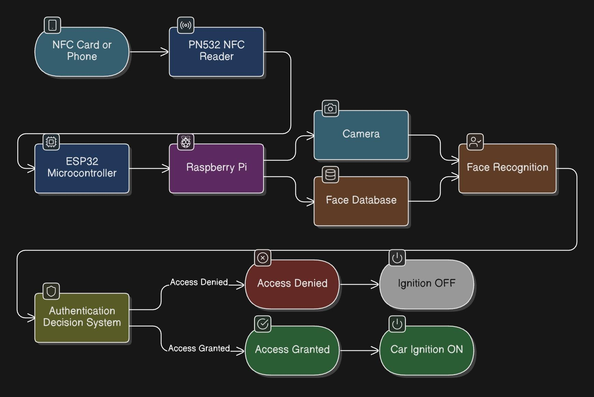
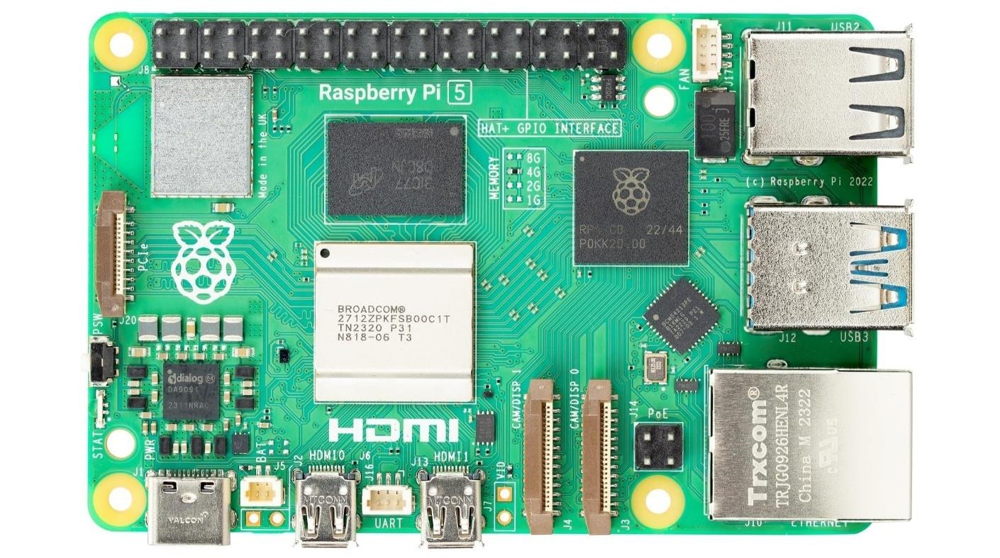
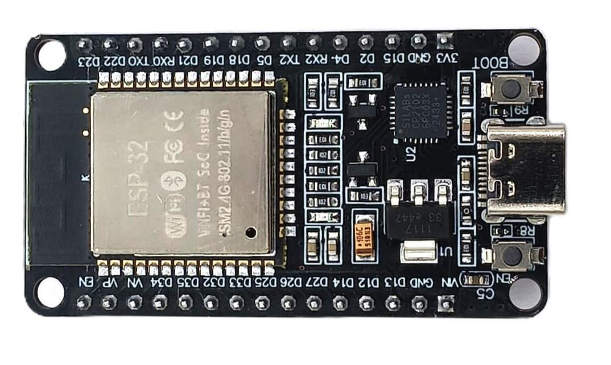
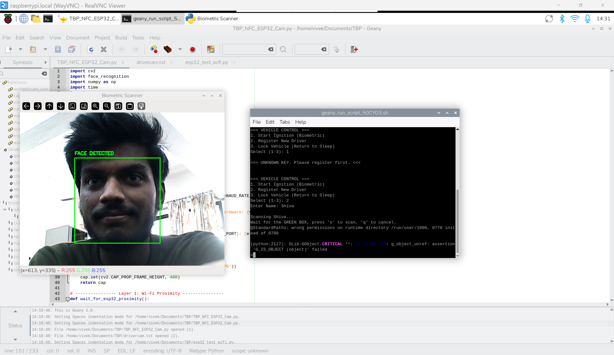
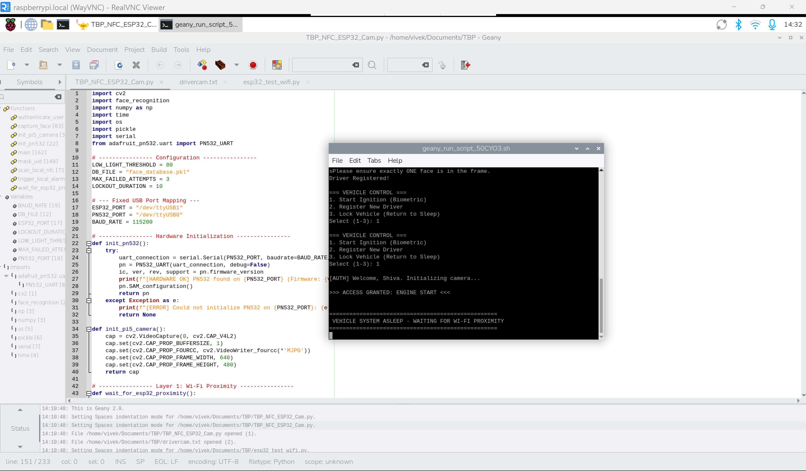

# 🚗 3-Factor Embedded Vehicle Security System

### Wi-Fi Proximity • NFC Authentication • Facial Recognition

Secure Embedded Vehicle Access using Raspberry Pi 5 & ESP32

</p>

<p align="center">


</p>

---

# 📖 Overview

Modern vehicle security systems require stronger authentication than conventional mechanical keys. Traditional key-based systems are vulnerable to theft, duplication, and unauthorized access.

This project presents a **Three-Factor Embedded Vehicle Security System** that integrates **Wi-Fi proximity detection**, **Near Field Communication (NFC)** authentication, and **Facial Recognition** to ensure that only authorized users can start the vehicle.

The system is built around a **Raspberry Pi 5** acting as the primary controller, while an **ESP32** functions as a low-power Wi-Fi proximity detector. Once a trusted device is detected nearby, the Raspberry Pi activates the authentication pipeline. The user must then authenticate using an NFC tag and facial recognition before access is granted.

The proposed architecture significantly improves vehicle security by combining embedded systems, computer vision, and IoT technologies into a single intelligent authentication platform.

---

# ✨ Key Features

- 🔐 Three-factor authentication
- 📶 Wi-Fi proximity detection using ESP32
- 💳 NFC authentication using PN532
- 👤 Facial recognition using OpenCV
- 🧠 Face encoding database
- 🖥 OLED status display
- 🚘 Secure vehicle ignition control
- 👥 Driver registration support
- 🚨 Automatic alarm after repeated failures
- ⚡ Low-power embedded architecture
- 🔄 Modular software design
- 📂 Expandable authentication database

---

# 🏗 System Architecture

<p align="center">



</p>

The complete authentication pipeline consists of three sequential security layers.

```
            User Approaches Vehicle
                     │
                     ▼
        ESP32 Wi-Fi Proximity Detection
                     │
                     ▼
        Raspberry Pi wakes from standby
                     │
                     ▼
            NFC Card Authentication
                     │
                     ▼
          UID Verification Database
                     │
          Valid? ────┴──── Invalid
             │                 │
             ▼                 ▼
      Face Recognition      Access Denied
             │
      Face Match?
       │          │
      Yes         No
       │          │
       ▼          ▼
 Engine Start   Alarm + Lockout
```

---

# ⚙ Hardware Components

| Component | Description |
|------------|-------------|
| Raspberry Pi 5 | Main Processing Unit |
| ESP32 Development Board | Wi-Fi Proximity Detection |
| PN532 NFC Reader | NFC Authentication |
| USB Webcam | Face Recognition |
| SSD1306 OLED Display | User Status Display |
| NFC Cards | Driver Authentication |
| USB-to-TTL Adapter | UART Communication |
| 5V / 5A Power Supply | Raspberry Pi Power |

---

# 🛠 Hardware

## Raspberry Pi 5

<p align="center">



</p>

The Raspberry Pi 5 performs:

- Facial Recognition
- Database Management
- NFC Verification
- OLED Control
- Vehicle Authentication Logic
- Serial Communication with ESP32

---

## ESP32

<p align="center">



</p>

The ESP32 continuously broadcasts a Wi-Fi access point.

When an authorized mobile device enters range, it immediately informs the Raspberry Pi that an authenticated user is nearby, reducing unnecessary power consumption.

---

# 🧰 Software Stack

| Software | Purpose |
|-----------|---------|
| Python 3 | Main Backend |
| OpenCV | Computer Vision |
| face_recognition | Face Matching |
| NumPy | Numerical Processing |
| PySerial | UART Communication |
| Pillow | OLED Graphics |
| Adafruit PN532 Library | NFC Interface |
| Adafruit SSD1306 | OLED Display |
| Arduino IDE | ESP32 Programming |
| Raspberry Pi OS | Operating System |

---

# 📂 Repository Structure

```text
NFC-Based-Vehicle-Ignition-System
│
├── README.md
├── LICENSE
├── .gitignore
├── CONTRIBUTING.md
├── CHANGELOG.md
│
├── docs
│   ├── Project_Report.pdf
│   └── Images
│
├── raspberry_pi
│   ├── vehicle_security.py
│   ├── sniff.py
│   └── requirements.txt
│
├── esp32
│   └── esp32_proximity.ino
│
├── images
│   ├── flow_diagram.png
│   ├── raspberry_pi5.png
│   ├── esp32.png
│   ├── authentication.png
│   └── demo_output.png
│
└── hardware
    └── components_list.md
```

---

# 🔄 Authentication Workflow

The project follows a **three-layer security architecture**.

### Layer 1 — Wi-Fi Proximity Detection

- ESP32 continuously broadcasts Wi-Fi.
- Detects an authorized mobile device.
- Sends `USER_PRESENT` to Raspberry Pi.
- Raspberry Pi wakes from standby.

---

### Layer 2 — NFC Authentication

- User taps NFC card.
- PN532 reads UID.
- Raspberry Pi compares UID with registered database.
- Unknown cards are rejected immediately.

---

### Layer 3 — Facial Recognition

- Camera activates.
- Face is detected.
- Face encoding generated.
- Compared with stored encoding.
- Successful match enables ignition.
- Failed attempts increment lockout counter.

---

# 💻 Raspberry Pi Software

The Raspberry Pi application (`vehicle_security.py`) manages:

- OLED Display
- NFC Reader
- Camera
- Face Recognition
- Driver Database
- Authentication Logic
- Vehicle Ignition
- Alarm Handling
- User Registration

# 📡 ESP32 Firmware

The ESP32 is programmed using the Arduino framework and serves as the **first authentication layer** of the system.

Unlike continuously running the Raspberry Pi, the ESP32 consumes very little power while monitoring for nearby trusted devices.

When an authorized mobile device connects to the ESP32 Wi-Fi access point:

- The ESP32 detects the client.
- Retrieves the MAC address.
- Sends a **USER_PRESENT** trigger to the Raspberry Pi via UART.
- The Raspberry Pi starts the remaining authentication process.

This architecture greatly reduces unnecessary processing and power consumption.

---

# 📂 Software Modules

## vehicle_security.py

The primary application responsible for:

- Initializing all hardware peripherals
- OLED management
- NFC reader communication
- Facial recognition
- Driver registration
- Authentication pipeline
- Local alarm
- Lockout mechanism
- Vehicle ignition logic

---

## esp32_proximity.ino

Responsible for:

- Creating Wi-Fi Access Point
- Monitoring connected clients
- Detecting trusted user devices
- Sending UART trigger messages
- Power-efficient operation

---

## sniff.py

Diagnostic utility used for:

- UART debugging
- ESP32 communication testing
- Serial data monitoring
- Demonstration during development

---

# 📦 Installation

## Raspberry Pi Setup

Update the operating system

```bash
sudo apt update
sudo apt upgrade
```

Install Python

```bash
sudo apt install python3 python3-pip
```

Install required libraries

```bash
pip install -r raspberry_pi/requirements.txt
```

---

## ESP32 Setup

1. Install Arduino IDE

2. Install ESP32 Board Package

3. Open

```
esp32/esp32_proximity.ino
```

4. Select

```
ESP32 Dev Module
```

5. Select the correct COM Port

6. Upload the firmware

---

## Hardware Connections

| Device | Interface |
|---------|-----------|
| ESP32 → Raspberry Pi | USB UART |
| PN532 → Raspberry Pi | USB UART |
| Webcam → Raspberry Pi | USB |
| OLED → Raspberry Pi | I2C |

---

# ▶ Running the Project

Move to Raspberry Pi directory

```bash
cd raspberry_pi
```

Run the main application

```bash
sudo python3 vehicle_security.py
```

---

For UART debugging

```bash
python3 sniff.py
```

---

# 📸 Project Demonstration

## Authentication Process

<p align="center">



</p>

The authentication screen demonstrates:

- Face Detection
- Driver Verification
- Successful Face Matching

---

## Final Output

<p align="center">



</p>

The system successfully performs:

- Wi-Fi Detection
- NFC Authentication
- Face Recognition
- Engine Start Authorization

---

# 🔐 Security Features

## Layer 1

### Wi-Fi Proximity Detection

✔ Low Power

✔ Fast Wake-up

✔ Trusted Device Detection

---

## Layer 2

### NFC Authentication

✔ Unique UID Verification

✔ Registered Driver Database

✔ Unknown Card Rejection

---

## Layer 3

### Facial Recognition

✔ Face Encoding

✔ Face Matching

✔ OpenCV Processing

✔ Biometric Verification

---

# 🚨 Lockout Mechanism

To prevent unauthorized access:

- Failed authentication attempts are counted.
- After reaching the configured threshold,
- Local alarm activates.
- System enters lockout mode.
- Authentication remains disabled until timeout expires.

---

# 📊 System Advantages

| Conventional Keys | Proposed System |
|-------------------|-----------------|
| Can be duplicated | NFC verification |
| Easily stolen | Three-factor authentication |
| No identity verification | Facial recognition |
| Mechanical wear | Contactless authentication |
| Single layer security | Multi-layer security |

---

# 📁 Driver Registration

The system allows authorized users to register themselves.

Registration consists of:

1. Tap NFC Card

2. Enter Driver Name

3. Capture Face

4. Generate Face Encoding

5. Save Driver Profile

Once completed, future authentication becomes automatic.

---

# 🧠 Face Recognition Pipeline

```
Camera Capture
      │
      ▼
Face Detection
      │
      ▼
Face Encoding
      │
      ▼
Database Comparison
      │
 ┌────┴────┐
 │         │
Match    No Match
 │         │
 ▼         ▼
Access   Denied
Granted
```

---

# 🛡 Error Handling

The software is capable of handling:

- Camera Failure
- Missing NFC Reader
- Serial Communication Errors
- Invalid NFC Tags
- Multiple Faces
- Face Mismatch
- OLED Failure
- ESP32 Disconnection
- USB Port Errors

---

# ⚡ Performance

Authentication requires only a few seconds.

Processing is optimized using:

- OpenCV
- Face Encodings
- Local Database
- USB UART Communication
- Lightweight ESP32 Firmware

---

# 📈 Results Summary

The developed prototype successfully demonstrated:

✅ Wi-Fi Proximity Detection

✅ NFC Authentication

✅ Facial Recognition

✅ OLED Status Display

✅ Driver Registration

✅ Vehicle Access Control

✅ Embedded Authentication

✅ Three-Factor Security

---

# 🚀 Future Scope

Although the proposed system successfully demonstrates a secure three-factor vehicle authentication mechanism, several enhancements can be incorporated to improve functionality, scalability, and real-world deployment.

## Planned Enhancements

- 📱 Mobile application for driver management
- ☁️ Cloud-based authentication and synchronization
- 📍 GPS-based vehicle tracking
- 📸 Infrared camera support for night-time authentication
- 🤖 AI-powered anti-spoofing and liveness detection
- 🔔 SMS / Email alerts during unauthorized access
- 📡 MQTT-based remote monitoring
- 🚗 CAN Bus integration for commercial vehicles
- 🔑 Smartphone NFC authentication
- 🔒 Encrypted cloud storage for driver profiles
- 📊 Authentication log dashboard
- 🔋 Ultra-low power optimization

---

# 🌍 Sustainable Development Goals (SDGs)

This project contributes to the following United Nations Sustainable Development Goals:

## SDG 9 — Industry, Innovation and Infrastructure

- Promotes embedded technologies.
- Encourages secure intelligent transportation systems.
- Demonstrates practical IoT implementation.

---

## SDG 11 — Sustainable Cities and Communities

- Improves vehicle safety.
- Supports smarter transportation infrastructure.
- Reduces vehicle theft and unauthorized access.

---

## SDG 16 — Peace, Justice and Strong Institutions

- Enhances digital security.
- Prevents unauthorized vehicle usage.
- Encourages secure authentication systems.

---

# 🚘 Applications

This project can be adapted for several real-world applications.

- Smart Vehicles
- Fleet Management
- Rental Vehicle Security
- University Campus Vehicles
- Corporate Transport
- Smart Parking Systems
- Industrial Vehicle Access
- Government Vehicle Authentication
- IoT Security Systems
- Embedded Authentication Devices

---

# 🏆 Project Highlights

✔ Three-Factor Authentication

✔ Raspberry Pi 5 Based Embedded System

✔ ESP32 Low Power Detection

✔ NFC Authentication

✔ Facial Recognition using OpenCV

✔ OLED Status Interface

✔ Driver Registration Module

✔ Local Alarm & Lockout

✔ Modular Software Architecture

✔ Scalable IoT Design

---

# 📂 Documentation

The repository includes complete documentation for the project.

| Folder | Description |
|---------|-------------|
| docs | Project report and supporting documentation |
| docs/Images | Images extracted from the report |
| images | Images used in the README |
| raspberry_pi | Raspberry Pi source code |
| esp32 | ESP32 firmware |
| hardware | Hardware component documentation |

---

# 📚 References

1. Raspberry Pi Foundation. *Raspberry Pi 5 Documentation.*

2. Espressif Systems. *ESP32 Programming Guide.*

3. OpenCV Documentation.

4. face_recognition Python Library Documentation.

5. Adafruit PN532 Library Documentation.

6. Adafruit SSD1306 OLED Documentation.

7. Arduino IDE Documentation.

8. Python Official Documentation.

---

# 👥 Authors

### B. Praneeth Reddy

---

### M. Shivanand Reddy

---

### C. Vivek


---


# 🤝 Contributing

Contributions are welcome.

If you wish to improve this project:

1. Fork the repository.

2. Create a new feature branch.

```bash
git checkout -b feature/your-feature
```

3. Commit your changes.

```bash
git commit -m "Add new feature"
```

4. Push to your fork.

```bash
git push origin feature/your-feature
```

5. Open a Pull Request.

---

# ⭐ Support

If you found this project useful, consider:

⭐ Starring this repository

🍴 Forking the project

📢 Sharing it with others

---

# 📧 Contact

For questions, suggestions, or collaborations, please open a GitHub Issue or Pull Request.

---

<p align="center">

### ⭐ Thank you for visiting this repository! ⭐

**If you like this project, don't forget to leave a ⭐ on GitHub.**

</p>
